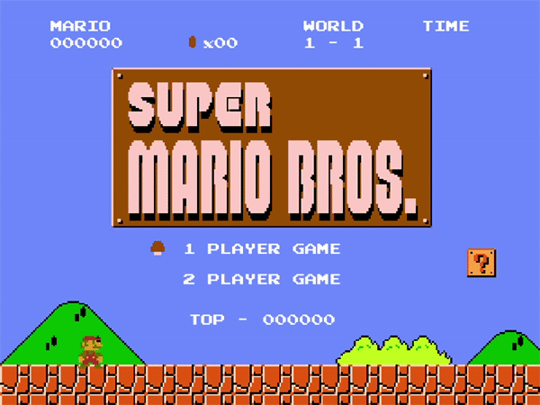

# **Super Mario Bros Python Project**

### ***AyayaPlayer*** 
-----------
本项目旨在通过pygame还原NES/FC主机上的超级马里奥兄弟游戏来促进对Python Programming的理解。项目中会包括文件处理，图像编辑，GUI编程，等。项目文件框架如下：

-----------
## 项目更新:

#### 2020/05/01: 

开始项目，建立文件框架，加入素材库，编写[第一个玩具代码](Test/Toy_Code/Toy_Code.py); 实现游戏800x600窗口，30FPS；导入第一个马里奥图片，并实现鬼畜，嘿嘿嘿：

#### 2020/05/02:

创建初始页面即主菜单，可选择1PLAYER和2PLAYER，虽然这两个不同功能还没完成（早着呢）；创建了过场界面，就是一个黑屏；创建了游戏主界面的静止画面，导入玩家即马里奥的图片，使用不同动作的图片组成对应的帧数，创建在不同情况下的马里奥动作动画，使得马里奥可以在上下左右键的控制下进行平行移动。

