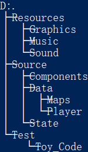
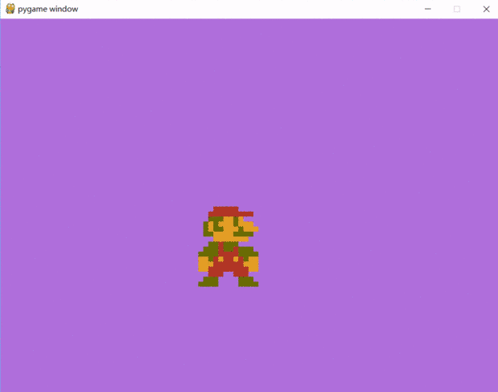

# **Super Mario Bros Python Project**

### ***AyayaPlayer*** 
-----------
本项目旨在通过pygame还原NES/FC主机上的超级马里奥兄弟游戏来促进对Python Programming的理解。项目中会包括文件处理，图像编辑，GUI编程，等。项目文件框架如下：

-----------
## 项目更新:

#### 2020/05/01: 

开始项目，建立文件框架，加入素材库，编写[第一个玩具代码](Test/Toy_Code/Toy_Code.py); 实现游戏800x600窗口，30FPS；导入第一个马里奥图片，并实现鬼畜，嘿嘿嘿：

